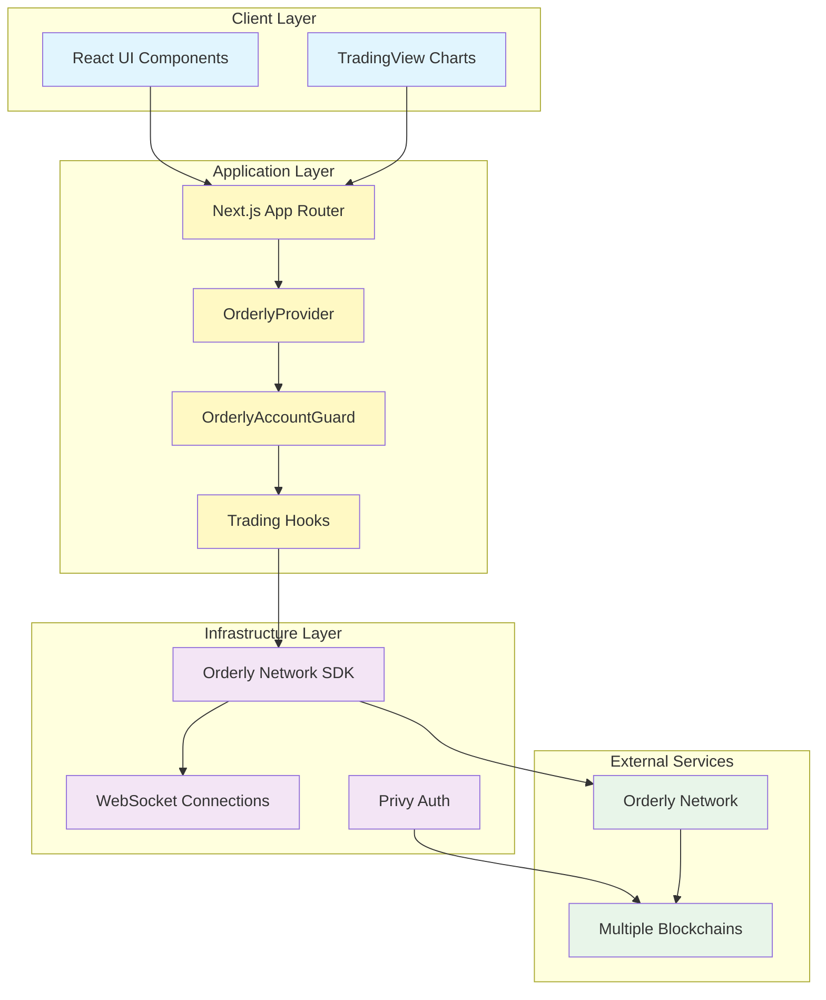
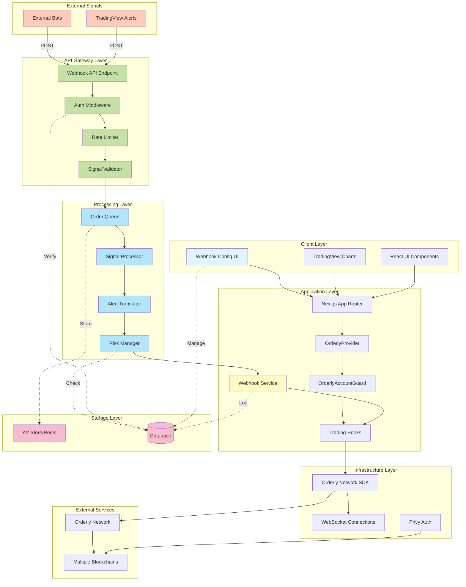
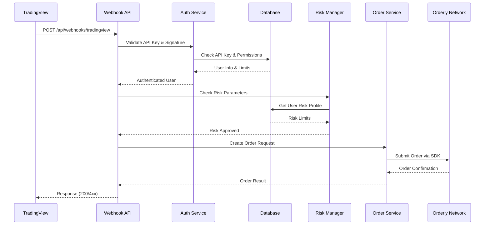
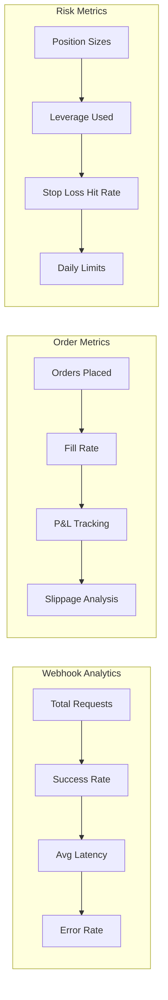

# TradingView Webhook Integration Architecture for KEK DEX

## Executive Summary

This document outlines the integration of TradingView webhook signals with KEK DEX's existing trading infrastructure. The solution enables automated order execution based on TradingView alerts while maintaining security, reliability, and seamless integration with the Orderly Network SDK.

## Current Architecture Overview



## Proposed Architecture with TradingView Webhooks



## Implementation Details

### 1. Webhook API Endpoint (`/api/webhooks/tradingview`)

```typescript
// src/app/api/webhooks/tradingview/route.ts
interface WebhookPayload {
  // TradingView alert payload
  alertId: string;
  action: 'buy' | 'sell' | 'close';
  symbol: string;
  price?: number;
  quantity?: number;
  orderType?: 'market' | 'limit' | 'stop';
  stopLoss?: number;
  takeProfit?: number;

  // Authentication
  apiKey: string;
  apiSecret: string;
  timestamp: number;
  signature: string;
}

interface WebhookResponse {
  success: boolean;
  orderId?: string;
  message?: string;
  error?: string;
}
```

### 2. Authentication & Security Flow



### 3. Core Components

#### A. Webhook Configuration Management

```typescript
// src/components/WebhookConfig.tsx
interface WebhookConfig {
  id: string;
  userId: string;
  name: string;
  apiKey: string;
  webhookUrl: string;
  enabled: boolean;
  allowedSymbols: string[];
  maxOrderSize: number;
  dailyLimit: number;
  riskParameters: {
    maxLeverage: number;
    maxPositionSize: number;
    requireStopLoss: boolean;
    maxDrawdown: number;
  };
  createdAt: Date;
  lastUsedAt?: Date;
}
```

#### B. Signal Processor Service

```typescript
// src/services/signalProcessor.ts
class SignalProcessor {
  async processWebhookSignal(
    payload: WebhookPayload,
    userConfig: WebhookConfig
  ): Promise<OrderEntity> {
    // 1. Validate signal format
    this.validateSignal(payload);

    // 2. Apply risk checks
    await this.applyRiskChecks(payload, userConfig);

    // 3. Translate to Orderly order format
    const orderParams = this.translateToOrderParams(payload);

    // 4. Execute order
    return await this.executeOrder(orderParams, userConfig.userId);
  }

  private translateToOrderParams(payload: WebhookPayload): OrderParams {
    return {
      symbol: this.normalizeSymbol(payload.symbol),
      side: payload.action === 'buy' ? OrderSide.BUY : OrderSide.SELL,
      orderType: this.mapOrderType(payload.orderType),
      quantity: payload.quantity,
      price: payload.price,
      stopLoss: payload.stopLoss,
      takeProfit: payload.takeProfit,
      reduceOnly: payload.action === 'close'
    };
  }
}
```

#### C. Rate Limiting & Queue Management

```typescript
// src/services/rateLimiter.ts
class RateLimiter {
  private redis: Redis;

  async checkLimit(userId: string, apiKey: string): Promise<boolean> {
    const key = `rate_limit:${userId}:${apiKey}`;
    const count = await this.redis.incr(key);

    if (count === 1) {
      await this.redis.expire(key, 60); // 1 minute window
    }

    return count <= MAX_REQUESTS_PER_MINUTE;
  }
}

// src/services/orderQueue.ts
class OrderQueue {
  private queue: Bull.Queue;

  async addOrder(orderRequest: OrderRequest): Promise<void> {
    await this.queue.add('process-order', orderRequest, {
      attempts: 3,
      backoff: {
        type: 'exponential',
        delay: 2000
      }
    });
  }

  async processOrder(job: Bull.Job): Promise<void> {
    const { orderRequest } = job.data;
    // Process order with retry logic
  }
}
```

### 4. User Interface Components

#### A. Webhook Management Dashboard

```typescript
// src/app/[lang]/portfolio/webhooks/view.tsx
export default function WebhooksView() {
  return (
    <Box p={6} intensity={900} r="xl">
      <WebhookDashboard>
        <WebhookList />
        <CreateWebhookModal />
        <WebhookLogs />
        <WebhookStats />
      </WebhookDashboard>
    </Box>
  );
}
```

#### B. TradingView Alert Template Generator

```typescript
// src/components/AlertTemplateGenerator.tsx
export function AlertTemplateGenerator({ webhookUrl, apiKey }) {
  const generateTemplate = (action: string) => {
    return JSON.stringify({
      action,
      symbol: "{{ticker}}",
      price: "{{close}}",
      quantity: 0.01,
      apiKey,
      timestamp: "{{timenow}}",
      signature: "{{strategy.order.id}}"
    }, null, 2);
  };

  return (
    <div>
      <h3>TradingView Alert Message Template</h3>
      <CodeBlock language="json">
        {generateTemplate('buy')}
      </CodeBlock>
      <CopyButton text={webhookUrl} label="Copy Webhook URL" />
    </div>
  );
}
```

### 5. Database Schema

```sql
-- Webhook configurations
CREATE TABLE webhook_configs (
  id UUID PRIMARY KEY DEFAULT gen_random_uuid(),
  user_id VARCHAR(255) NOT NULL,
  name VARCHAR(255) NOT NULL,
  api_key VARCHAR(255) UNIQUE NOT NULL,
  api_secret_hash VARCHAR(255) NOT NULL,
  enabled BOOLEAN DEFAULT true,
  allowed_symbols TEXT[],
  max_order_size DECIMAL(20, 8),
  daily_limit DECIMAL(20, 8),
  risk_parameters JSONB,
  created_at TIMESTAMP DEFAULT NOW(),
  updated_at TIMESTAMP DEFAULT NOW()
);

-- Webhook execution logs
CREATE TABLE webhook_logs (
  id UUID PRIMARY KEY DEFAULT gen_random_uuid(),
  webhook_config_id UUID REFERENCES webhook_configs(id),
  request_payload JSONB,
  response_payload JSONB,
  order_id VARCHAR(255),
  status VARCHAR(50),
  error_message TEXT,
  execution_time_ms INTEGER,
  created_at TIMESTAMP DEFAULT NOW()
);

-- Rate limiting
CREATE TABLE rate_limits (
  user_id VARCHAR(255),
  api_key VARCHAR(255),
  window_start TIMESTAMP,
  request_count INTEGER,
  PRIMARY KEY (user_id, api_key, window_start)
);
```

### 6. Security Considerations

#### A. API Key Management
- Generate unique API keys per webhook configuration
- Store API secrets using bcrypt hashing
- Implement key rotation mechanism
- Support multiple keys per user

#### B. Request Validation
- HMAC signature verification
- Timestamp validation (prevent replay attacks)
- IP whitelisting (optional)
- SSL/TLS enforcement

#### C. Risk Management
- Position size limits
- Daily trading limits
- Leverage restrictions
- Mandatory stop-loss for high-risk trades
- Account balance checks

### 7. Error Handling & Monitoring

```typescript
// src/services/webhookMonitor.ts
class WebhookMonitor {
  async logExecution(
    config: WebhookConfig,
    request: WebhookPayload,
    response: WebhookResponse,
    executionTime: number
  ) {
    await this.db.webhook_logs.create({
      webhook_config_id: config.id,
      request_payload: request,
      response_payload: response,
      status: response.success ? 'success' : 'failed',
      error_message: response.error,
      execution_time_ms: executionTime
    });

    // Send metrics to monitoring service
    this.metrics.record({
      event: 'webhook_execution',
      success: response.success,
      execution_time: executionTime,
      user_id: config.userId
    });

    // Alert on failures
    if (!response.success) {
      await this.alertService.notifyFailure(config, response.error);
    }
  }
}
```

### 8. Implementation Phases

#### Phase 1: Core Infrastructure (Week 1-2)
- [ ] Set up webhook API endpoint
- [ ] Implement authentication middleware
- [ ] Create signal validation service
- [ ] Add rate limiting

#### Phase 2: Order Processing (Week 2-3)
- [ ] Build signal translator
- [ ] Integrate with Orderly SDK
- [ ] Implement order queue
- [ ] Add retry mechanism

#### Phase 3: User Interface (Week 3-4)
- [ ] Create webhook management UI
- [ ] Build alert template generator
- [ ] Add webhook testing tools
- [ ] Implement logs viewer

#### Phase 4: Security & Monitoring (Week 4-5)
- [ ] Add comprehensive logging
- [ ] Implement monitoring dashboard
- [ ] Set up alerting system
- [ ] Conduct security audit

#### Phase 5: Testing & Documentation (Week 5-6)
- [ ] Write unit tests
- [ ] Create integration tests
- [ ] Load testing
- [ ] User documentation

### 9. Configuration Example

```typescript
// src/config/webhook.config.ts
export const webhookConfig = {
  // Rate limiting
  rateLimit: {
    maxRequestsPerMinute: 10,
    maxRequestsPerHour: 100,
    maxRequestsPerDay: 1000
  },

  // Order limits
  orderLimits: {
    minOrderSize: 0.001,
    maxOrderSize: 1000,
    maxLeverage: 10,
    maxOpenPositions: 10
  },

  // Security
  security: {
    requireSignature: true,
    maxTimestampAge: 60000, // 60 seconds
    ipWhitelist: process.env.IP_WHITELIST?.split(',') || [],
    requireStopLoss: true
  },

  // Queue configuration
  queue: {
    concurrency: 5,
    maxRetries: 3,
    retryDelay: 2000
  }
};
```

### 10. Usage Example

#### Step 1: User creates webhook configuration in KEK DEX
```typescript
POST /api/portfolio/webhooks
{
  "name": "My TradingView Strategy",
  "allowedSymbols": ["BTC-PERP", "ETH-PERP"],
  "maxOrderSize": 100,
  "dailyLimit": 10000,
  "riskParameters": {
    "maxLeverage": 5,
    "requireStopLoss": true
  }
}

Response:
{
  "webhookUrl": "https://kekdex.com/api/webhooks/tradingview",
  "apiKey": "wh_live_abc123...",
  "apiSecret": "whs_xyz789..."
}
```

#### Step 2: User configures TradingView alert
```javascript
// TradingView Pine Script Alert Message
{
  "action": "buy",
  "symbol": "BTC-PERP",
  "quantity": 0.1,
  "orderType": "market",
  "stopLoss": 65000,
  "takeProfit": 72000,
  "apiKey": "wh_live_abc123...",
  "timestamp": {{timenow}},
  "signature": "{{strategy.order.id}}"
}
```

#### Step 3: Webhook processes the order
```typescript
// Automatic order execution flow
1. Receive webhook POST request
2. Validate API key and signature
3. Check rate limits
4. Validate order parameters
5. Apply risk checks
6. Submit order to Orderly Network
7. Log execution
8. Return response to TradingView
```

### 11. Monitoring Dashboard



### 12. Benefits

1. **Automation**: Execute trades automatically based on TradingView signals
2. **Strategy Integration**: Connect any TradingView strategy to KEK DEX
3. **Risk Management**: Built-in risk controls and position limits
4. **Monitoring**: Real-time tracking of webhook performance
5. **Security**: Multiple layers of authentication and validation
6. **Scalability**: Queue-based processing for high-volume trading
7. **Flexibility**: Support for multiple order types and parameters

### 13. API Documentation

#### Webhook Endpoint

**URL**: `POST /api/webhooks/tradingview`

**Headers**:
```
Content-Type: application/json
X-Webhook-Signature: {HMAC-SHA256 signature}
```

**Request Body**:
```json
{
  "alertId": "string",
  "action": "buy|sell|close",
  "symbol": "BTC-PERP",
  "quantity": 0.1,
  "orderType": "market|limit",
  "price": 70000,
  "stopLoss": 68000,
  "takeProfit": 72000,
  "apiKey": "wh_live_...",
  "timestamp": 1234567890,
  "signature": "abc123..."
}
```

**Response**:
```json
{
  "success": true,
  "orderId": "ord_123456",
  "executedPrice": 70050,
  "executedQuantity": 0.1,
  "timestamp": 1234567891
}
```

**Error Response**:
```json
{
  "success": false,
  "error": "Rate limit exceeded",
  "retryAfter": 60
}
```

### 14. Testing Strategy

```typescript
// src/tests/webhook.test.ts
describe('Webhook Integration', () => {
  test('should process valid buy signal', async () => {
    const response = await request(app)
      .post('/api/webhooks/tradingview')
      .send(validBuySignal)
      .expect(200);

    expect(response.body.success).toBe(true);
    expect(response.body.orderId).toBeDefined();
  });

  test('should reject invalid signature', async () => {
    const response = await request(app)
      .post('/api/webhooks/tradingview')
      .send(invalidSignatureSignal)
      .expect(401);

    expect(response.body.error).toContain('Invalid signature');
  });

  test('should enforce rate limits', async () => {
    // Send multiple requests
    for (let i = 0; i < 11; i++) {
      await request(app)
        .post('/api/webhooks/tradingview')
        .send(validSignal);
    }

    const response = await request(app)
      .post('/api/webhooks/tradingview')
      .send(validSignal)
      .expect(429);

    expect(response.body.error).toContain('Rate limit');
  });
});
```

## Conclusion

This TradingView webhook integration provides KEK DEX users with powerful automation capabilities while maintaining security and reliability. The architecture leverages existing Orderly Network infrastructure and adds a robust webhook processing layer that can handle high-volume automated trading with proper risk controls.

The modular design allows for easy extension and modification, while the comprehensive monitoring and logging ensure operational visibility. With this integration, KEK DEX becomes a fully-featured automated trading platform that can execute strategies from TradingView or any other webhook-capable platform.